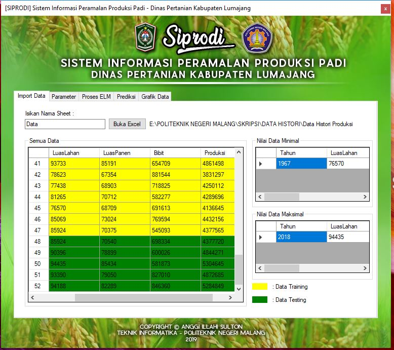
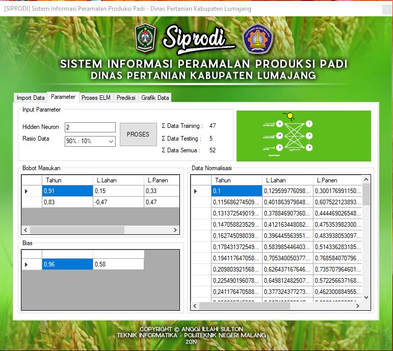
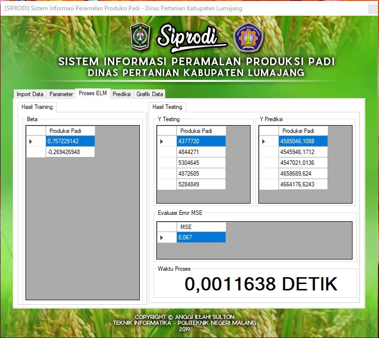
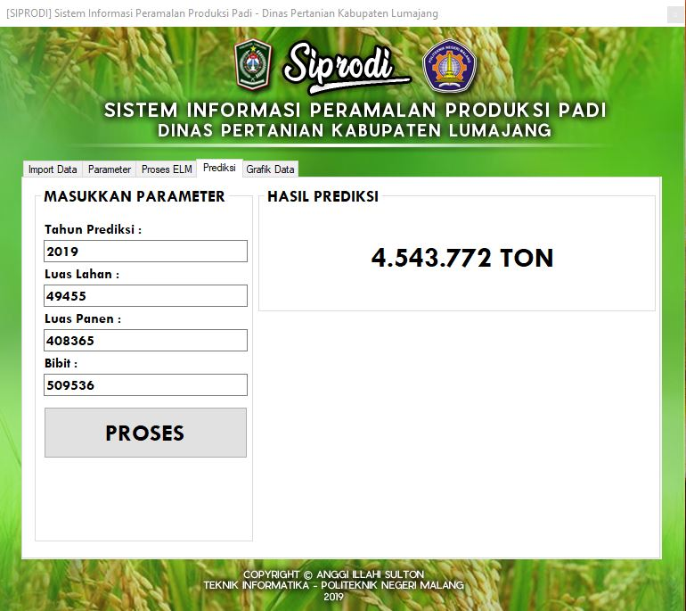

# EXTREME LEARNING MACHINE in C #

## Explanation:
Application of Artificial Neural Networks (ANN) with the Extreme Learning Machine (ELM) learning algorithm. The ELM method has advantages in learning speed and a small error rate. The evaluation and research process starts from data normalization, training process, testing process, data denormalization, and error evaluation using Mean Square Error (MSE). I use this method to predict rice production in Lumajang Regency, because this district is an area with rice production that always increases every year in order to realize national food security. In order to stabilize rice production every year, the Agriculture Office of Lumajang Regency needs to do forecasting with approximate calculations. This study aims to build a computer-based rice production forecasting system using the C # programming language, so that it can help predict rice production in the following year.

## App Display:
### 1. Data Import

### 2. Input Parameters

### 3. ELM Process Results

### 4. Prediction Process

### 5. Data Graphs

## Explanation of the Method in the ELM process:
### A. Data Normalization Method (Method Name: normalisasi)
The normalization function accepts input parameters such as datasets, minimal data, and maximum data
### B. Initialize Weight (Method Name: generate_bobot)
The generate_bobot function accepts input parameters in the form of hidden_neuron and input_layer. The process of forming the input weight matrix with the order of hidden neurons x input layer. Initialize random objects and weight values. The iteration process to fill the weights_input matrix with randomized values ​​from -1 to 1 and round up the value to 2 digits after the comma.
### C. Initialization of Bias (Method Name: generate_bias)
The bias function accepts input parameters in the form of hidden_neuron. The process of forming a biased matrix with the order of 1 x hidden neurons. Initialize random objects and input values. The process of repeating to fill the biased matrix with random values ​​from 0 to 1 and rounding up the value to 2 digits behind the comma.
### D. Transpose Matrix (Method Name: matriks_transpose)
The matrix_transpose function accepts the input matrix parameters to be transposed. The process of forming a new matrix with the name matrix_transpose with the order matrix column input x row matrix input. The iteration process to transpose a matrix by changing the rows and columns of the input matrix into new columns and rows stored in the new matrix_transpose matrix.
### E. Multiplication of Matrices (Method Name: matriks_perkalian)
The matrix multiplication function accepts input parameters such as matrixA and matrixB. The process of forming a new matrix with the name matrix_hasil with the order matrix row A x column matrix B. The iteration process to do matrix multiplication by multiplying matrix A rows with matrixB column and storing the results of matrix multiplication in the result matrix.
### F. Summation of Matrices with Bias (Method Name: hitung_H)
The matrix sum function with bias accepts input parameters such as H_init and Bias. Iteration process to do the sum of the H_init matrix with the bias matrix so that the H_init matrix is obtained.
### G. Training Process - Hinit Calculation (Method used: matriks_tranpose, matriks_perkalian, ditambah_bias)
Perform the weight matrix transpose process by calling the matrix_transpose function and provide the weight_input matrix as the input matrix for the function and accept the return of the transpose function as the weight_input_transpose matrix. Perform the matrix multiplication process by calling the multiplication matrix function and providing the X_training matrix and weight_input_transpose as the input matrix for the function and accepting the return function multiplication as the H_init matrix. Carry out the process of adding the matrix by calling the added_bias function and giving the H_init input matrix and bias and accepting the return function as the H_init matrix.
### H. Training Process - H Eksponential Calculation (Method used: Hitung_H)
Perform the H calculation process by calling the hitung_H function or the function to calculate the activation using a binary sigmoid. The hitung_H function requires an input parameter which is the H_init matrix that has been previously calculated. The sigmoid_biner function will return the value that will be stored on the matrix H. The H calculation function accepts input parameters in the form of the Hinit and H. matrices. The iteration process to do the H calculation uses the binary sigmoid activation function.
### I. Training Process - Calculation of Inverse Matrices (Method Name: inverse_matriks)
The inverse_matriks function accepts parameters as matrixA which the inverse process will do. Initialize new matrices, i.e. matrices and matrix_invers. Matrices are input matrices that will be inverted while matrix_invers are matrices that will later be inversed. The iteration process to copy the input matrix matrixA to the matrix matrix so that the inverse process does not eliminate the initial matrix value The iteration process to make the matrix_invers into an identity matrix. The iteration process which is the core of the inverse process in this function is to complete the inverse process using the OBE method. The OBE method compares the initial matrix with the identity matrix and then performs a series of calculation steps to make the initial matrix into an identity matrix while the initial identity matrix becomes the result of the inverse process.
### J. Training Process - H + Calculations (Method Name: matriks_perkalian, inverse_matrix)
Perform the H matrix transpose process by calling the matrix_transpose function and providing the H matrix value as an input parameter. The function will return the value and be stored in the H_transpose matrix. Perform the matrix multiplication process between the H_transpose matrix and the H matrix using the multiplication matrix function. The function will return the value and save it in the _HT_H matrix. Perform the inverse _HT_H matrix by calling the inverse_matriks function. The function will return the value and save it on the HT_H matrix. Perform the matrix multiplication process between the HT_H matrix and the H_transpose matrix using the multiplication matrix function. The function will return the value and be stored in the H_plus matrix.
### K. Training Process - Beta Calculation (Method Name: matriks_perkalian)
Perform matrix multiplication process between H_plus matrix and Y_training matrix using multiplication matrix function. The function will return the value and store it in the beta matrix. The beta matrix will be used for the next testing phase.
### L. Testing Process - Hinit Calculation (Method Name: matriks_transpose, matriks_perkalian, ditambah_bias)
Perform the weight matrix transpose process by calling the matrix_transpose function and provide the weight_input matrix as the input matrix for the function and accept the return of the transpose function as the weight_input_transpose matrix. Perform the matrix multiplication process by calling the multiplication matrix function and providing the X_uji matrix and weight_input_transpose as the input matrix for the function and accepting the return function multiplication as the H_init_uji matrix. Carry out the process of adding the matrix by calling the plus_bias function and giving the H_init_uji input matrix and bias and accepting the return function as the H_init_uji matrix.
### M. Testing Process - Hexapential Calculation (Method Name: hitung_H)
Perform the H_uji calculation process by calling the hitung_H function or a function to calculate the activation using a binary sigmoid. The hitung_H function requires an input parameter, the H_init_uji matrix, which has been calculated previously. The sigmoid_biner function will return the value that will be stored in the H_uji matrix. The H calculation function accepts input parameters in the form of a H_init matrix and H The iteration process to do the H calculation uses the binary sigmoid activation function.
### N. Testing Process - Calculation of Y testing (Method Name: perkalian_matriks)
Perform the matrix multiplication process between the H_uji matrix with the beta matrix using the multiplication matrix function. The function will give a return value and be stored in the Y_p predictor matrix.
### O. Testing Process - MSE Error Evaluation Calculation (Method Name: hitung_MSE)
The hitung_MSE function requires input parameters namely the predicted Y_picture matrix, Y_uji and the MSE matrix. The hitung_MSE function will return the value that will be stored in the MSE matrix. The hitung_MSE function accepts parameters as the Y_prediction matrix, Y_uji matrix and MSE matrix.
## Example of How to Use:
<b> Explanation of method and parameter calls:
get_latih (dataA, dataB);

Information :
- get_latih = method name
- dataA = Input parameter
- dataB = Input parameter

Initialization of training data in the form of arrays with double data types
<b> double [,] data_training = new double [Number of Rows, Number of Columns]; </b>

Fill data_training by calling the get_training method by entering the normalization data parameter and the training data
<b> data_training = get_training (data_normalisation, data_training); </b>

Calling several methods in 1 method, like the example in the training method below will call several methods:

// training process method

            public double[,] Training(int hidden_neuron, int input_layer, int output_layer, double[,] data_normalisasi, double[,] data_latih, double[,] bobot_input, double[,] bias)
        { 
            double[,] X_training = new double[data_latih.GetLength(0), input_layer]; //inisialisasi array X training dgn jumlah baris sesuai jumlah data latih, kolom sesuai jumlah input_layer
            double[,] Y_training = new double[data_latih.GetLength(0), output_layer]; //inisialisasi array Y training 
            double[,] bobot_input_transpose = new double[input_layer, hidden_neuron]; //inisalisasi array bobot input
            double[,] H_init = new double[data_latih.GetLength(0), hidden_neuron]; //inisialisasi array Hinit
            double[,] H = new double[data_latih.GetLength(0), hidden_neuron]; ////inisialisasi array H atau Hexp
            double[,] H_transpose = new double[hidden_neuron, data_latih.GetLength(0)]; //inisialisasi array H traspose
            double[,] HT_H = new double[hidden_neuron, hidden_neuron]; //inisialisasi array hasil matriks invers
            double[,] _HT_H = new double[hidden_neuron, hidden_neuron]; //inisialisasi array dari hasil perkalian H transpose dgn Heksp atau H
            double[,] H_plus = new double[hidden_neuron, data_latih.GetLength(0)]; //inisialisasi array H+ dari hasil perkalian HT_H dengan Htranspose
            double[,] beta = new double[hidden_neuron, output_layer]; //inisialisasi array beta atau hasil training
            data_latih = get_latih(data_normalisasi, data_latih); //Get data latih sesuai rasio
            
            X_training = get_X(data_latih); //Memisah data latih menjadi X
            Y_training = get_Y(data_latih); //Memisah data latih menjadi Y

            //Menghitung H_init
            bobot_input_transpose = matriks_transpose(bobot_input);
            H_init = matriks_perkalian(X_training, bobot_input_transpose);
            H_init = dikali_bias(H_init, bias);
            
            //Menghitung H
            H = hitung_H(H_init, H);
            
            //Menghitung H+
            H_transpose = matriks_transpose(H);
            _HT_H = matriks_perkalian(H_transpose, H);
            HT_H = inverse_matriks(_HT_H);
            H_plus = matriks_perkalian(HT_H, H_transpose);

            //Menghitung beta
            beta = matriks_perkalian(H_plus, Y_training);

            //ngeprint beta di table view
            this.dataGridView7.ColumnCount = beta.GetLength(1);
            for (int r = 0; r < beta.GetLength(0); r++)
            {
                string[] baris1 = new string[beta.GetLength(1)];
                for (int c = 0; c < beta.GetLength(1); c++)
                {
                    baris1[c] = Convert.ToString(beta[r, c]);
                }
                dataGridView7.Rows.Add(baris1);
            }
            
            return beta;
        }
  
## Rice Production Dataset:
https://drive.google.com/file/d/1cDTiFhX50kBZpyBfbEnt7lUlINtl9Ij8/view?usp=sharing
