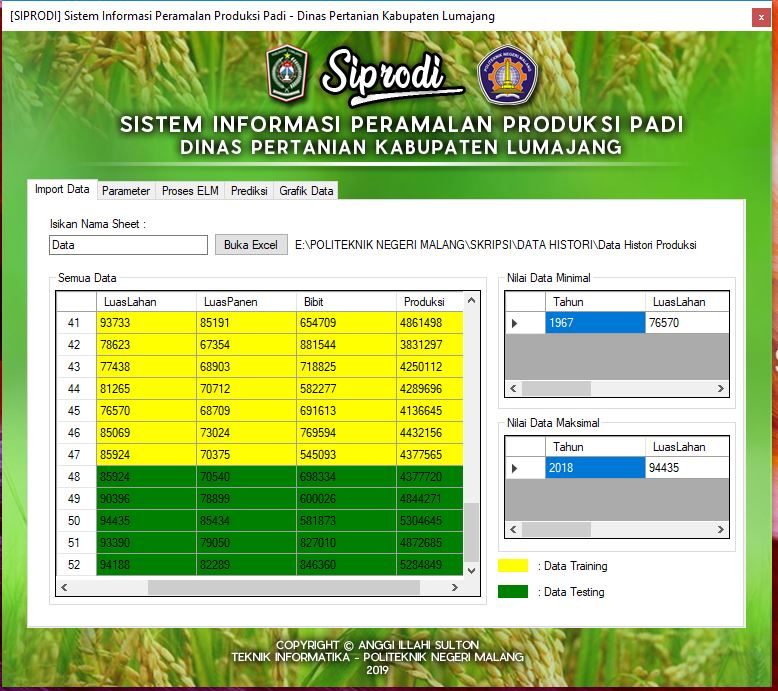
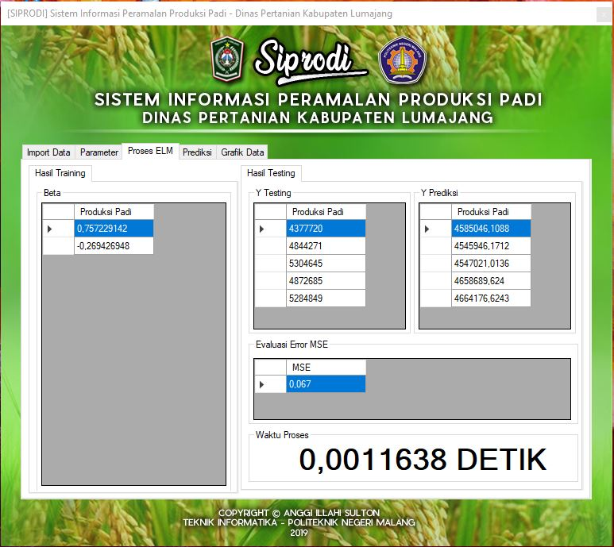

# EXTREME LEARNING MACHINE in C#

## Penjelasan :
Penerapan Jaringan Syaraf Tiruan (JST) dengan algoritma pembelajaran Extreme Learning Machine (ELM). Metode ELM memiliki kelebihan dalam learning speed dan tingkat error yang kecil. Proses evaluasi dan penelitian ini dimulai dari normalisasi data, proses training, proses testing, denormalisasi data, dan evaluasi error menggunakan Mean Square Error (MSE). Penerapan metode ini saya gunakan untuk memprediksi produksi padi di Kabupaten Lumajang, dikarenakan kabupaten ini menjadi daerah dengan produksi padi yang selalu meningkat di setiap tahunnya demi mewujudkan ketahanan pangan nasional. Dalam rangka menstabilkan produksi padi setiap tahun, Dinas Pertanian Kabupaten Lumajang perlu melakukan peramalan dengan perhitungan perkiraan. Penelitian ini bertujuan untuk membangun sistem peramalan produksi padi berbasis komputer dengan menggunakan bahasa pemrograman C#, sehingga dapat membantu meramalkan produksi padi di tahun selanjutnya.

## Tampilan Aplikasi :
### 1.Impor Data

### 2. Input Parameter

### 3. Hasil Proses ELM

### 4. Proses Prediksi

### 5. Grafik Data

## Penjelasan Method dalam proses ELM :
### A. Method Normalisasi Data
Fungsi normalisasi menerima parameter masukan berupa dataset, data minimal, dan data maksimal
### B. Inisialisasi Bobot
Fungsi generate_bobot menerima parameter masukan berupa hidden_neuron dan input_layer. Proses pembentukan matriks bobot_input dengan ordo hidden neuron x input layer. Inisialisasi objek random dan nilai bobot. Proses perulangan untuk mengisi matriks bobot_input dengan nilai yang telah diacak dari -1 sampai 1 serta membulatkan nilainya menjadi 2 angka di belakang koma.
### C. Inisialisasi Bias
Fungsi bias menerima parameter masukan berupa hidden_neuron. Proses pembentukan matriks bias dengan ordo 1 x hidden neuron. Inisialisasi objek random dan nilai masukan. Proses perulangan untuk mengisi matriks bias dengan nilai yang telah diacak dari 0 sampai 1 serta membulatkan nilainya menjadi 2 angka di belakang koma.
### D. Transpose Matriks
Fungsi matriks_transpose menerima parameter matriks masukan yang akan di transpose. Proses pembentukan matriks baru dengan nama matriks_transpose dengan ordo kolom matriks masukan x baris matriks masukan. Proses perulangan untuk melakukan transpose matriks dengan cara mengubah baris dan kolom matriks masukan menjadi kolom dan baris baru yang disimpan pada matriks baru matriks_transpose.
### E. Perkalian Matriks
Fungsi perkalian matriks menerima parameter masukan berupa matriksA dan matriksB. Proses pembentukan matriks baru dengan nama matriks_hasil dengan ordo baris matriksA x kolom matriksB. Proses perulangan untuk melakukan perkalian matriks dengan cara mengalikan baris matriksA dengan kolom matriksB dan menyimpan hasil perkalian matriks pada matriks_hasil.
### F. Penjumlahan Matriks dengan Bias

### G. Proses Training - Perhitungan Hinit

### H. Proses Training - Perhitungan Heksponential

### I. Proses Training - Perhitungan Invers Matriks

### J. Proses Training - Perhitungan H+

### K. Proses Training - Perhitungan Beta

### L. Proses Testing - Perhitungan Hinit

### M. Proses Testing - Perhitungan Heksponential

### N. Proses Testing - Perhitungan Y testing

### O. Proses Testing - Perhitungan Evaluasi Error MSE

## Cara Penggunaan :

