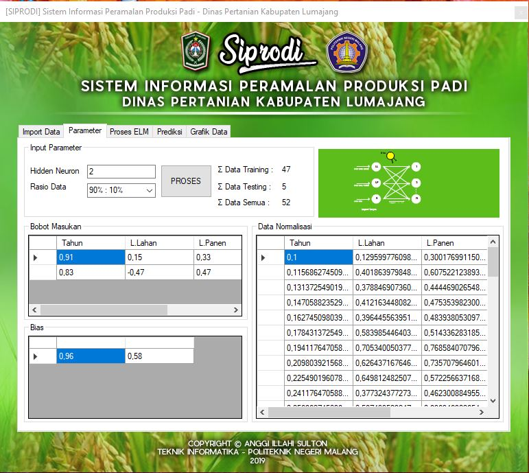
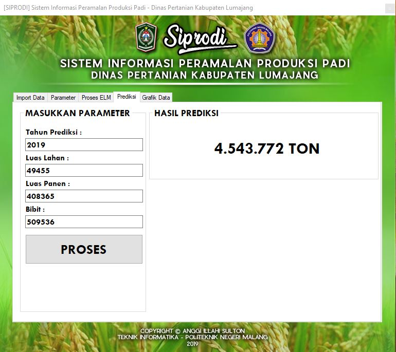

# EXTREME LEARNING MACHINE in C#

## Penjelasan :
Penerapan Jaringan Syaraf Tiruan (JST) dengan algoritma pembelajaran Extreme Learning Machine (ELM). Metode ELM memiliki kelebihan dalam learning speed dan tingkat error yang kecil. Proses evaluasi dan penelitian ini dimulai dari normalisasi data, proses training, proses testing, denormalisasi data, dan evaluasi error menggunakan Mean Square Error (MSE). Penerapan metode ini saya gunakan untuk memprediksi produksi padi di Kabupaten Lumajang, dikarenakan kabupaten ini menjadi daerah dengan produksi padi yang selalu meningkat di setiap tahunnya demi mewujudkan ketahanan pangan nasional. Dalam rangka menstabilkan produksi padi setiap tahun, Dinas Pertanian Kabupaten Lumajang perlu melakukan peramalan dengan perhitungan perkiraan. Penelitian ini bertujuan untuk membangun sistem peramalan produksi padi berbasis komputer dengan menggunakan bahasa pemrograman C#, sehingga dapat membantu meramalkan produksi padi di tahun selanjutnya.

## Tampilan Aplikasi :
### 1.Impor Data

### 2.Input Parameter

### 3.Hasil Proses ELM

### 4.Proses Prediksi

### 5.Grafik Data

## Penjelasan Method dalam proses ELM :
### A. Method Normalisasi Data
Fungsi normalisasi menerima parameter masukan berupa dataset, data minimal, dan data maksimal
### B. Inisialisasi Bobot
Fungsi generate_bobot menerima parameter masukan berupa hidden_neuron dan input_layer. Proses pembentukan matriks bobot_input dengan ordo hidden neuron x input layer. Inisialisasi objek random dan nilai bobot. Proses perulangan untuk mengisi matriks bobot_input dengan nilai yang telah diacak dari -1 sampai 1 serta membulatkan nilainya menjadi 2 angka di belakang koma.
### C. Inisialisasi Bias
Fungsi bias menerima parameter masukan berupa hidden_neuron. Proses pembentukan matriks bias dengan ordo 1 x hidden neuron. Inisialisasi objek random dan nilai masukan. Proses perulangan untuk mengisi matriks bias dengan nilai yang telah diacak dari 0 sampai 1 serta membulatkan nilainya menjadi 2 angka di belakang koma.
### D. Transpose Matriks
Fungsi matriks_transpose menerima parameter matriks masukan yang akan di transpose. Proses pembentukan matriks baru dengan nama matriks_transpose dengan ordo kolom matriks masukan x baris matriks masukan. Proses perulangan untuk melakukan transpose matriks dengan cara mengubah baris dan kolom matriks masukan menjadi kolom dan baris baru yang disimpan pada matriks baru matriks_transpose.
### E. Perkalian Matriks
Fungsi perkalian matriks menerima parameter masukan berupa matriksA dan matriksB. Proses pembentukan matriks baru dengan nama matriks_hasil dengan ordo baris matriksA x kolom matriksB. Proses perulangan untuk melakukan perkalian matriks dengan cara mengalikan baris matriksA dengan kolom matriksB dan menyimpan hasil perkalian matriks pada matriks_hasil.
### F. Penjumlahan Matriks dengan Bias
Fungsi penjumlahan matriks dengan bias menerima parameter masukan berupa H_init dan Bias. Proses perulangan untuk melakukan penjumlahan matriks H_init dengan matriks bias sehingga diperoleh matriks H_init.
### G. Proses Training - Perhitungan Hinit
Melakukan proses transpose matriks bobot dengan cara melakukan pemanggilan fungsi matriks_transpose dan memberikan matriks bobot_input sebagai matriks masukan untuk fungsi tersebut serta menerima kembalian fungsi transpose sebagai matriks bobot_input_transpose. Melakukan proses perkalian matriks dengan cara melakukan pemanggilan fungsi matriks_perkalian dan memberikan matriks X_training dan bobot_input_transpose sebagai matriks masukan untuk fungsi tersebut serta menerima kembalian fungsi perkalian sebagai matriks H_init. Melakukan proses penjumlahan matriks dengan cara melakukan pemanggilan fungsi ditambah_bias danmemberikan matriks masukan H_init dan bias serta menerima kembalian fungsi sebagai matriks H_init.
### H. Proses Training - Perhitungan Heksponential
Melakukan proses perhitungan H dengan cara memanggil fungsi hitung_H atau fungsi untuk menghitung aktivasi menggunakan sigmoid biner. Fungsi hitung_H membutuhkan parameter masukan yaitu matriks H_init yang telah dihitung sebelumnya. Fungsi sigmoid_biner akan memberikan nilai kembalian yang akan disimpan pada matriks H. Fungsi perhitungan H menerima parameter masukan berupa matriks Hinit dan H. Proses perulangan untuk melakukan perhitungan H menggunakan fungsi aktivasi sigmoid biner.
### I. Proses Training - Perhitungan Invers Matriks
Fungsi inverse_matriks menerima parameter sebagai matriksA yang akan dilakukan proses invers. Inisialisasi matriks baru yaitu matriks dan matriks_invers. Matriks adalah matriks masukan yang akan diinvers sedangkan matriks_invers adalah matriks yang nantinya bernilai hasil proses invers. Proses perulangan untuk menyalin nilai masukan matriksA ke matriks matriks agar proses invers tidak menghilangkan nilai matriks awal
Proses perulangan untuk membuat matriks_invers menjadi matriks identitas. Proses perulangan yang merupakan inti dari proses invers dalam fungsi ini yaitu menyelesaikan proses invers menggunakan metode OBE. Metode OBE menyandingkan matriks awal dengan matriks identitas selanjutnya melakukan serangkaian tahap perhitungan untuk menjadikan matriks awal menjadi matriks identitas sedangkan matriks identitas awal menjadi hasil proses invers.
### J. Proses Training - Perhitungan H+
Melakukan proses transpose matriks H dengan cara memanggil fungsi matriks_transpose dan memberikan nilai matriks H sebagai parameter masukan. Fungsi tersebut akan memberikan nilai kembalian dan disimpan pada matriks H_transpose Melakukan proses perkalian matriks antara matriks H_transpose dengan matriks H menggunakan fungsi matriks_perkalian. Fungsi tersebut akan memberikan nilai kembalian dan disimpan pada matriks _HT_H. Melakukan proses invers matriks _HT_H dengan cara memanggil fungsi inverse_matriks. Fungsi tersebut akan memberikan nilai kembalian dan disimpan pada matriks HT_H. Melakukan proses perkalian matriks antara matriks HT_H dengan matriks H_transpose menggunakan fungsi matriks_perkalian. Fungsi tersebut akan memberikan nilai kembalian dan disimpan pada matriks H_plus.
### K. Proses Training - Perhitungan Beta
Melakukan proses perkalian matriks antara matriks H_plus dengan matriks Y_training menggunakan fungsi matriks_perkalian. Fungsi tersebut akan memberikan nilai kembalian dan disimpan pada matriks beta. Matriks beta akan digunakan untuk tahap testing selanjutnya. 
### L. Proses Testing - Perhitungan Hinit
Melakukan proses transpose matriks bobot dengan cara melakukan pemanggilan fungsi matriks_transpose dan memberikan matriks bobot_input sebagai matriks masukan untuk fungsi tersebut serta menerima kembalian fungsi transpose sebagai matriks bobot_input_transpose. Melakukan proses perkalian matriks dengan cara melakukan pemanggilan fungsi matriks_perkalian dan memberikan matriks X_uji dan bobot_input_transpose sebagai matriks masukan untuk fungsi tersebut serta menerima kembalian fungsi perkalian sebagai matriks H_init_uji. Melakukan proses penjumlahan matriks dengan cara melakukan pemanggilan fungsi ditambah_bias danmemberikan matriks masukan H_init_uji dan bias serta menerima kembalian fungsi sebagai matriks H_init_uji.
### M. Proses Testing - Perhitungan Heksponential
Melakukan proses perhitungan H_uji dengan cara memanggil fungsi hitung_H atau fungsi untuk menghitung aktivasi menggunakan sigmoid biner. Fungsi hitung_H membutuhkan parameter masukan yaitu matriks H_init_uji yang telah dihitung sebelumnya. Fungsi sigmoid_biner akan memberikan nilai kembalian yang akan disimpan pada matriks H_uji. Fungsi perhitungan H menerima parameter masukan berupa matriks H_init dan H
Proses perulangan untuk melakukan perhitungan H menggunakan fungsi aktivasi sigmoid biner.
### N. Proses Testing - Perhitungan Y testing
Melakukan proses perkalian matriks antara matriks H_uji dengan matriks beta menggunakan fungsi matriks_perkalian. Fungsi tersebut akan memberikan nilai kembalian dan disimpan pada matriks Y_prediksi.
### O. Proses Testing - Perhitungan Evaluasi Error MSE
Fungsi hitung_MSE membutuhkan parameter masukan yaitu matriks Y_prediksi yang telah dihitung sebelumnya, Y_uji dan matriks MSE. Fungsi hitung_MSE akan memberikan nilai kembalian yang akan disimpan pada matriks MSE. Fungsi hitung_MSE menerima parameter sebagai matriks Y_prediksi, matriks Y_uji dan matriks MSE.

## Contoh Cara Penggunaan :
<b> Penjelasan pemanggilan method dan parameter :
get_latih(dataA, dataB);

Keterangan :
- get_latih = nama method
- dataA = Parameter masukan
- dataB = Parameter masukan

Inisialisasi data latih berbentuk array dengan type data double
<b>double[,] data_latih = new double[Jumlah Baris, Jumlah Kolom]; </b>

Mengisi data_latih dengan memanggil method get_latih dengan memasukkan parameter data normalisasi dan data latih
<b> data_latih = get_latih(data_normalisasi, data_latih); </b>

Memanggil beberapa method dalam 1 method ini, seperti contoh pada method training di bawah ini akan memanggil beberapa method :

//method proses training

            public double[,] Training(int hidden_neuron, int input_layer, int output_layer, double[,] data_normalisasi, double[,] data_latih, double[,] bobot_input, double[,] bias)
        { 
            double[,] X_training = new double[data_latih.GetLength(0), input_layer]; //inisialisasi array X training dgn jumlah baris sesuai jumlah data latih, kolom sesuai jumlah input_layer
            double[,] Y_training = new double[data_latih.GetLength(0), output_layer]; //inisialisasi array Y training 
            double[,] bobot_input_transpose = new double[input_layer, hidden_neuron]; //inisalisasi array bobot input
            double[,] H_init = new double[data_latih.GetLength(0), hidden_neuron]; //inisialisasi array Hinit
            double[,] H = new double[data_latih.GetLength(0), hidden_neuron]; ////inisialisasi array H atau Hexp
            double[,] H_transpose = new double[hidden_neuron, data_latih.GetLength(0)]; //inisialisasi array H traspose
            double[,] HT_H = new double[hidden_neuron, hidden_neuron]; //inisialisasi array hasil matriks invers
            double[,] _HT_H = new double[hidden_neuron, hidden_neuron]; //inisialisasi array dari hasil perkalian H transpose dgn Heksp atau H
            double[,] H_plus = new double[hidden_neuron, data_latih.GetLength(0)]; //inisialisasi array H+ dari hasil perkalian HT_H dengan Htranspose
            double[,] beta = new double[hidden_neuron, output_layer]; //inisialisasi array beta atau hasil training
            data_latih = get_latih(data_normalisasi, data_latih); //Get data latih sesuai rasio
            
            X_training = get_X(data_latih); //Memisah data latih menjadi X
            Y_training = get_Y(data_latih); //Memisah data latih menjadi Y

            //Menghitung H_init
            bobot_input_transpose = matriks_transpose(bobot_input);
            H_init = matriks_perkalian(X_training, bobot_input_transpose);
            H_init = dikali_bias(H_init, bias);
            
            //Menghitung H
            H = hitung_H(H_init, H);
            
            //Menghitung H+
            H_transpose = matriks_transpose(H);
            _HT_H = matriks_perkalian(H_transpose, H);
            HT_H = inverse_matriks(_HT_H);
            H_plus = matriks_perkalian(HT_H, H_transpose);

            //Menghitung beta
            beta = matriks_perkalian(H_plus, Y_training);

            //ngeprint beta di table view
            this.dataGridView7.ColumnCount = beta.GetLength(1);
            for (int r = 0; r < beta.GetLength(0); r++)
            {
                string[] baris1 = new string[beta.GetLength(1)];
                for (int c = 0; c < beta.GetLength(1); c++)
                {
                    baris1[c] = Convert.ToString(beta[r, c]);
                }
                dataGridView7.Rows.Add(baris1);
            }
            
            return beta;
        }
  
## Dataset Produksi Padi :
https://drive.google.com/file/d/1cDTiFhX50kBZpyBfbEnt7lUlINtl9Ij8/view?usp=sharing
